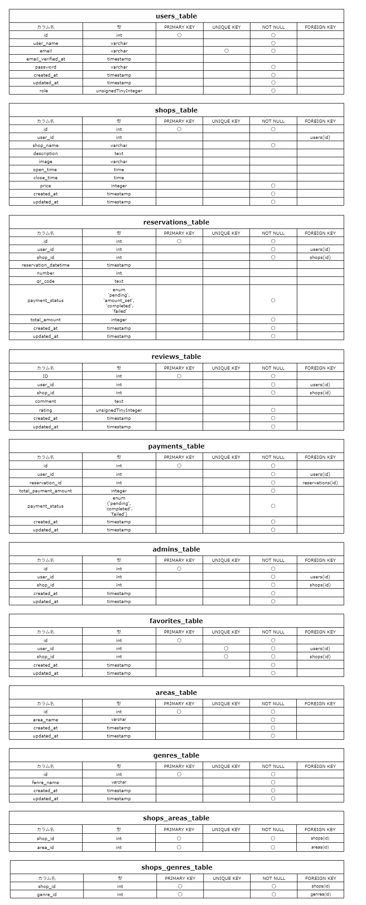
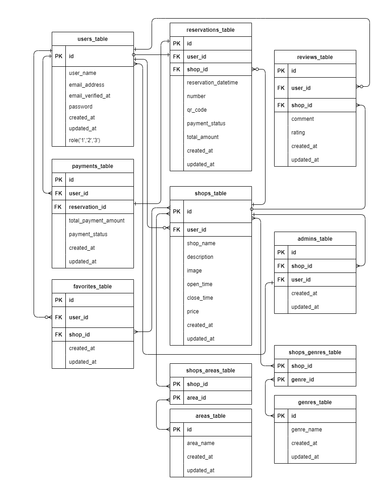
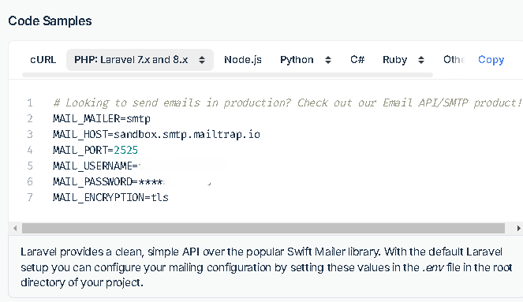

<p align="center">         </p>

<h3 align="center"> Rese（リーズ）飲食店予約サービスアプリ </h3>

<p align="center">
   
   
   
</p>

#### サービス概要

- 飲食店予約サービス Rese（リーズ）は、ある企業のグループ会社向けの飲食店予約サービスです。外部サービスに依存せず、手数料を節約しながら自社で完全にコントロール可能な予約システムを提供します。

### 制作の背景と目的

外部の飲食店予約サービスでは手数料が発生するため、自社で予約サービスを持つことでコスト削減とデータ管理の自由度を高めたいと考えています。

### 制作の目標

- 初年度でのユーザー数 10,000 人を達成する。
- 直感的で使いやすいインターフェースを提供する。

### 機能要件

- **共通管理画面**: 管理者、店舗代表者、予約ユーザー(利用者)の 3 種類の権限に基づく管理画面を提供。

#### 予約ユーザーの画面

- **店舗一覧表示・検索機能**: エリア、ジャンル、店舗名での検索することができる。
- **お気に入り追加・解除機能**: ユーザーはお気に入り追加や解除することができる。
- **マイページ表示機能**: 予約状況・お気に入り店舗の表示。
- **店舗詳細表示・予約機能**: ユーザーは一覧画面から店舗詳細画面を見ることができ予約することができる。
- **予約変更機能**: ユーザーはマイページから予約日時や人数を変更・削除できる。
- **決済機能**: ユーザーはマイページの予約情報よりキャッシュレス決済することができる。
- **評価機能**: 来店＆決済終了にて、ユーザーが店舗を 5 段階で評価し、コメントを残せる。
- **バリデーション**: 認証と予約の際に FormRequest を使用してバリデーションを行う。
- **認証**: メールによる本人確認機能。
- **リマインダー**: タスクスケジューラーを利用して、予約当日の朝にリマインダーを送信。
- **QR コード**: 予約時に QR コードを発行し、来店時に提示できる。
- **レスポンシブデザイン**: スマートフォン、タブレット、PC など様々な画面サイズに対応

#### 管理者画面

- **管理(管理者)**

- **新規店舗登録機能**：管理者は新規店舗の登録、店舗代表者の登録ができる。
- **店舗一覧表示**: 登録されている店舗の一覧を表示し、詳細を確認・削除できる。
- **評価機能**: ユーザーが店舗を 5 段階で評価したものを閲覧・削除できる。
- **レスポンシブデザイン**: スマートフォン、タブレット、PC など様々な画面サイズに対応。

#### 店舗代表者の画面

- **管理(店舗代表者)**

- **ストレージ**: 店舗の画像をストレージに保存。
- **メール送信**: 管理画面から利用者にお知らせメールを送信。
- **QR コード**: 利用者が来店時に提示する QR コードを店舗側で照合できる。
- **金額設定機能**: 店舗代表者が予約ユーザーに金額を設定すると決済ボタンが表示されユーザーが決済できる。
- **決済管理機能**: Stripe を利用した決済機能。予約に対する支払い状況の確認管理できる 。
- **評価機能**: ユーザーが店舗を 5 段階で評価したものを管理者ページで閲覧できる。
- **店舗情報編集機能**：店舗の情報を照会・編集することができる。
- **レスポンシブデザイン**: スマートフォン、タブレット、PC など様々な画面サイズに対応。

### 作業範囲

- 設計
- コーディング
- テスト

### ターゲットユーザー

- 20〜30 代の社会人

### システム要件

- **開発言語**: PHP
- **フレームワーク**: Laravel
- **データベース**: MySQL
- **バージョン管理**: GitHub

### 使用技術

- **フロントエンド**: HTML, CSS, JavaScript
- **バックエンド**: PHP, Laravel
- **データベース**: MySQL
- **バージョン管理**: Git, GitHub

### コントリビューション

このプロジェクトはクローズドソースであり、特定のグループ会社の内部使用に限られています。外部からのコントリビューションは受け付けていません。

### ライセンス

このプロジェクトは特定のクライアントにのみ提供される専用のソフトウェアです。再配布や商用利用は禁止されています。

#### 使用技術（実行環境）

- **開発言語**: PHP
- **フレームワーク**: Laravel 8.x
- **データベース**: MySQL
- **バージョン管理**: GitHub
- **コンテナ化技術**: Docker

#### テーブル設計



#### ER 図



#### 環境構築

- **PHP**: 8.1.32
- **MySQL**: 8.0.26
- **Composer**: 2.8.6
- **Docker**: 28.0.4
- **Laravel Framework**: 8.83.27

- ＊ご使用の PC に合わせて各種必要なファイル(.env や docker-compose.yml 等)は作成、編集してください。

- **1.docker-compose exec bash**
- **2.composer install**
- **3..env.example ファイルから.env を作成し、環境変数を変更**
- **4.php artisan key:generate**
- **5.php artisan migrate**
- **6.php artisan db:seed**

#### クローン作製手順

1. GitHub リポジトリのクローン

```bash
git clone https://github.com/ponponmama/20240713-erika_hara-rese.git
```

```bash
cd 20240713-erika_hara-rese
```

2. 必要なパッケージのインストール

```bash　
sudo apt-get update
```

3. SSL 証明書の生成

QR コードを照合するためにカメラにアクセスするため、HTTPS 環境が必要です。SSL 証明書を生成します。

**プロジェクトルートディレクトリ（ホスト側）で実行してください。** コンテナ内ではなく、ホスト側で実行します。

まず、証明書を配置するディレクトリを作成します：

```bash
mkdir -p docker/nginx/ssl
```

```bash
cd docker/nginx/ssl
```

次に、openssl コマンドを使用して SSL 証明書を生成します：

```bash
openssl req -x509 -nodes -days 365 -newkey rsa:2048 -keyout nginx.key -out nginx.crt
```

このコマンド実行時には、以下の情報を対話形式で入力します：

- 国名 (Country Name) - 例: `JP`
- 都道府県名 (State or Province Name) - 例: `Tokyo`
- 市区町村名 (Locality Name) - 例: `Tokyo`
- 組織名 (Organization Name) - 例: `Development`
- 組織単位名 (Organizational Unit Name) - オプション（空白でも可）
- 共通名 (Common Name) - 例: `localhost`
- メールアドレス (Email Address) - オプション（空白でも可）

これにより、`docker/nginx/ssl/nginx.key` (秘密鍵) と `docker/nginx/ssl/nginx.crt` (公開証明書) が生成されます。

プロジェクトルートに戻ります：

```bash
cd ../../..
```

4. Docker コンテナのビルドと起動

```bash
docker-compose up -d --build
```

3. Composer を使用した依存関係のインストール

- github からクローンを作成するといくつかのフォルダが足りません。src に setup.sh を作成してあります。プロジェクトはフレームワーク内にインストールするので、先にフォルダ作成お願いします。

- Docker 環境で PHP コンテナに入り、依存関係をインストールします。

- 3-1. コンテナに入ります。

```bash
docker-compose exec php bash
```

- 3-2. スクリプトに実行権限を付与します。

- プロジェクトを始める前に、QR コード保存用のフォルダを作成する。src に setup.sh を作成してあります。プロジェクトはフレームワーク内にインストールするので、先にフォルダ作成お願いします。

```bash
chmod +x setup.sh
```

```bash
./setup.sh
```

- 以下のフォルダが作成されます

```
      storage/app/public/qr_codes \
```

<br>

#### "ディレクトリが正常に作成されました。" ← このメッセージが出ます。<br>

<br>

- 3-3. curl 拡張機能の確認とインストール

curl 拡張機能が正しくロードされているか確認します：

```bash
php -m | grep curl
```

正しく curl 拡張機能がロードされている場合、"curl"の文字が表示されます。

**もし"curl"が表示されない場合**は、curl 拡張機能をインストールする必要があります。

PHP のバージョンを確認します：

```bash
php -v
```

確認したバージョンに合わせて curl 拡張機能をインストールします（例：PHP 8.1 の場合）：

```bash
apt-get update
```

```bash
apt-get install -y php8.1-curl
```

または、利用可能なパッケージを確認してからインストール：

```bash
apt-cache search php-curl
```

インストール後、再度確認します：

```bash
php -m | grep curl
```

- 3-4. composer インストール

```bash
composer install
```

4. 環境設定ファイルの設定

- .env.example ファイルを .env としてコピーし、必要に応じてデータベースなどの設定を行います。

```bash
cp .env.example .env
```

- 環境設定を更新した後、設定キャッシュをクリアするために以下のコマンドを実行します。これにより、新しい設定がアプリケーションに反映されます。

```bash
docker-compose exec php bash
```

```bash
php artisan config:clear
```

この手順は、特に環境変数が更新された後や、`.env` ファイルに重要な変更を加えた場合に重要です。設定キャッシュをクリアすることで、古い設定が引き続き使用されることを防ぎます。

5. 環境設定手順

#### HTTPS 設定（SSL 証明書を生成した場合のみ）

SSL 証明書を生成した場合は、以下の手順で HTTPS を有効化してください。

#### Docker 環境設定

`docker-compose.yml` ファイルを使用して、Docker 環境を構築します。HTTPS 用のポート 443 を開放し、SSL 証明書と秘密鍵を適切な場所にマウントします。

#### docker-compose.yml を編集

`docker-compose.yml` の `nginx` サービスの `volumes` セクションに以下を追加してください：

```yaml
ports:
  - "443:443" # HTTPS用のポートを追加
volumes:
  - ./docker/nginx/default.conf:/etc/nginx/conf.d/default.conf
  - ./src:/var/www/
  - <証明書を配置したディレクトリ>/nginx.crt:/etc/nginx/ssl/nginx.crt # SSL証明書をマウント
  - <証明書を配置したディレクトリ>/nginx.key:/etc/nginx/ssl/nginx.key # 秘密鍵をマウント
```

**重要**:

- ボリュームマウントは `ホスト側のパス:コンテナ内のパス` の形式で指定する必要があります
- `<証明書を配置したディレクトリ>` の部分は、実際に証明書を生成したディレクトリのパスに置き換えてください（例：`./src` や `./certificates` など）
- コンテナ内のパスは `/etc/nginx/ssl/` ディレクトリにマウントしてください

**証明書の配置場所による設定方法**:

- **README.md の通りに`docker/nginx/ssl`に証明書を生成した場合**:

  - `docker-compose.yml`のポート 443 と SSL 証明書のマウント設定のコメントアウトを外すだけで使用できます
  - `default.conf`の SSL 設定のコメントアウトも外してください

- **ご自分の環境に合わせて別のディレクトリに証明書を生成した場合**:
  - `<証明書を配置したディレクトリ>` の部分を、実際に証明書を生成したディレクトリのパスに置き換えてください（例：`./src` や `./certificates` など）
  - `docker-compose.yml`のポート 443 と SSL 証明書のマウント設定のコメントアウトを外し、パスを調整してください
  - `default.conf`の SSL 設定のコメントアウトも外してください

#### default.conf を編集

`docker/nginx/default.conf` ファイルに以下を追加してください：

```nginx
listen 443 ssl;
ssl_certificate /etc/nginx/ssl/nginx.crt; # SSL証明書へのパス
ssl_certificate_key /etc/nginx/ssl/nginx.key; # 秘密鍵へのパス
```

設定を更新した後、以下のコマンドを使用して Docker コンテナを再起動してください。これにより、新しい設定が適用されます。

```bash
docker-compose down
```

```bash
docker-compose up -d
```

#### ディレクトリの作成とストレージ設定

**重要：このアプリでは、シンボリックリンクはすでに設定されており、リポジトリに含まれています。新しい環境でプロジェクトをセットアップする際は、リンクが正しく機能しているかを確認してください。機能していない場合もしくは手動で設定したい場合は下記の通り設定しなおしてください。**

```bash
mkdir -p /path/to/your/project/storage/app/public/images
```

```bash
mkdir -p /path/to/your/project/storage/app/public/qr_codes
```

```bash
docker-compose exec php bash
```

```bash
php artisan storage:link
```

次に、これらのディレクトリに適切なパーミッションを設定してください。これにより、アプリケーションがファイルを適切に読み書きできるようになります。

```bash
chmod -R 775 /var/www/storage/app/public/images
```

```bash
chmod -R 775 /var/www/storage/app/public/qr_codes
```

```bash
chown -R www-data:www-data /var/www/storage/app/public
```

これらのコマンドは、アプリケーションが画像や QR コードを保存するためのディレクトリに適切なアクセス権を設定するために必要です。`www-data` はウェブサーバーのユーザーですが、使用しているサーバーによっては異なるユーザー名になる場合があるため、環境に合わせて適宜変更してください。

6. アプリケーションキーの生成

```bash
docker-compose exec php bash
```

```bash
php artisan key:generate
```

6.データベースのマイグレーション

```bash
php artisan migrate
```

7.データベースシーダーの実行

```bash
php artisan db:seed
```

＊マイグレーションとシーダーを同時に実行する場合

```bash
php artisan migrate --seed
```

- ＊テスト用のダミーデータは人数を少なくしております。必要に応じて編集してください。

#### リマインダーメールを送るために必要な Cron ジョブの設定手順

##### Laravel スケジューラを利用するためには、Cron ジョブの設定だけでなく、Laravel のスケジューラを適切に設定する必要があります。以下に、Laravel のスケジューラ設定の完全な手順を示します。

- Laravel スケジューラの設定

Laravel のスケジューラを使用するには、app/Console/Kernel.php ファイル内でスケジュールされたタスクを定義する必要があります。以下は、Kernel.php ファイルにスケジュールを設定する方法の例です。

protected function schedule(Schedule $schedule)
{
// ここにスケジュールされたコマンドを追加します。
$schedule->command('inspire')
->hourly();

         // 予約リマインダーメールを毎日朝7時に送信するスケジュール
         $schedule->command('send:reservation-reminder')
                  ->dailyAt('07:00')
                  ->appendOutputTo(storage_path('logs/reservation_reminder.log'));

}

この設定では、send:reservation-reminder コマンドが毎日 7 時に実行され、その実行結果が storage/logs/reservation_reminder.log に記録されます。appendOutputTo メソッドを使用して、コマンドの出力をログファイルに追記するように設定しています。時間は指定したい時刻に変更ください。

### メール設定

プロジェクトでは開発環境でのメール送信のテストに Mailtrap を使用しています。


**1.アカウント作成\***
`https://mailtrap.io/` のサイトからサインアップタブをクリックし、アカウント作成します。


**2. Start testing のクリック**
赤枠の部分の Start testing をクリックします。もしくは、左サイドバーで「Email Testing」＞「Inboxes」をクリックします。


**3. Inbox 画面への移動**
Inbox 画面に移動したら、Integrations のセレクトボックスをクリックしてください。


**4. フレームワークの選択**
使用しているフレームワーク等を選びます。Laravel8 を使っていたので Laravel 8.x を選びました。


**5. Laravel の設定**
laravel 8.x を選択したら、Laravel8 の設定をクリックします。


**6. .env 設定のコピー**
Laravel を選択した場合は以下のように.env に貼り付ける用のコードが出ますので、コピーします。



**7. .env ファイルへの設定追加**
下の設定を `.env` ファイルに追加してください。これにより、開発中のメール送信を安全にテストすることができます。

- `MAIL_MAILER`: メールドライバー（例: smtp, sendmail）
- `MAIL_HOST`: メールサーバーのホスト名
- `MAIL_PORT`: メールサーバーのポート番号
- `MAIL_USERNAME`: メールサーバーのユーザー名
- `MAIL_PASSWORD`: メールサーバーのパスワード
- `MAIL_ENCRYPTION`: メール送信の暗号化方式（例: tls, ssl）
- `MAIL_FROM_NAME`: メール送信時の差出人名（環境変数 `APP_NAME` を使用する場合もあり）

```plaintext
MAIL_MAILER=smtp
MAIL_HOST=sandbox.smtp.mailtrap.io
MAIL_PORT=2525
MAIL_USERNAME=your_mailtrap_username # Mailtrapのユーザー名をここに入力
MAIL_PASSWORD=your_mailtrap_password # Mailtrapのパスワードをここに入力
MAIL_ENCRYPTION=tls
MAIL_FROM_NAME="${APP_NAME}" # アプリケーション名を使用する場合
MAIL_LOG_CHANNEL=stack
```

この設定を適用後、アプリケーションからのメールは Mailtrap の仮想 SMTP サーバーを通じて送信され、実際には配信されずに Mailtrap のダッシュボードで確認することができます。

### Stripe 設定

Stripe は、オンライン決済プラットフォームとして広く利用されています。このセクションでは、Stripe を使用して安全に決済を処理するための設定手順を詳しく説明します。
プロジェクトで決済処理を行うために Stripe を使用します。Stripe の API キーを設定することで、安全に決済を処理できます。以下の手順に従って設定を行ってください。

1. **アカウント作成**: Stripe の公式ウェブサイト（[https://stripe.com](https://stripe.com)）にアクセスし、アカウントを作成します。アカウント作成は無料で、メールアドレスと基本的な情報を入力するだけで完了します。
   今すぐ始めるをクリック
   
   基本情報を入力後アカウントを作成をクリック
   
   登録したメールアドレスにメールが届くので認証する
   

2. **ダッシュボード**: アカウント作成後、Stripe のダッシュボードにログインします。ダッシュボードからは、API キーの管理、トランザクションの確認、支払い設定の変更などが行えます。


3. **Stripe ライブラリのインストール**: Stripe 提供の公式ライブラリを使用すると、API の呼び出しが容易になります。Laravel プロジェクトであれば、Composer を使用して Stripe PHP ライブラリをインストールできます。Docker を使用している場合は、以下のコマンドを実行します。

   ```bash
   docker-compose exec php bash
   ```

   ```bash
   composer require stripe/stripe-php
   ```

4. **API キーの取得**: ダッシュボード内の「Developers」セクションから「API keys」を選択し、必要な API キー（公開キーと秘密キー）をメモします。これらのキーは、アプリケーションから Stripe API を安全に呼び出すために使用します。
   テストするのみなら、テスト環境ボタンをスライドしテスト環境にする

   - `STRIPE_KEY`: Stripe の公開可能キー（Public key）
   - `STRIPE_SECRET`: Stripe の秘密キー（Secret key）

5. `.env` ファイルを開き、以下の環境変数を更新します：

```plaintext
   STRIPE_KEY=ここに公開可能キーを貼り付ける
   STRIPE_SECRET=ここに秘密キーを貼り付ける
```

6. **決済処理の実装**: Laravel アプリケーションで決済処理を行うためには、以下のステップを実行します。

   - **コントローラーの作成**: Stripe の API を呼び出して決済を処理するためのコントローラーを作成します。このコントローラーでは、カード情報を受け取り、Stripe に対して支払いをリクエストする処理を実装します。

   - **ビューページの作成**: ユーザーがカード情報を入力するためのフォームを含むビューページを作成します。このページは、入力された情報をコントローラーに送信するためのものです。

   - **ルーティングの設定**: ビューページとコントローラーを結びつけるためのルーティングを設定します。

   - **バリデーションの追加**: 入力されたカード情報のバリデーションを行い、不正なデータが処理されないようにします。

#### セキュリティ対策

- **API キーの保護**: API キーは秘密情報です。公開リポジトリにはアップロードしないようにし、アクセス制御が適切に設定された環境変数を通じて管理します。
- **HTTPS の使用**: クライアントとサーバー間の通信には HTTPS を使用し、データの暗号化を保証します。これにより、中間者攻撃による情報漏洩のリスクを軽減します。

これらの手順に従うことで、Stripe を使用した決済処理を安全かつ効率的に行うことができます。

### URL

- **開発環境:** [https://localhost/](https://localhost/)
- **phpMyAdmin:** [http://localhost:8080/](http://localhost:8080/)
